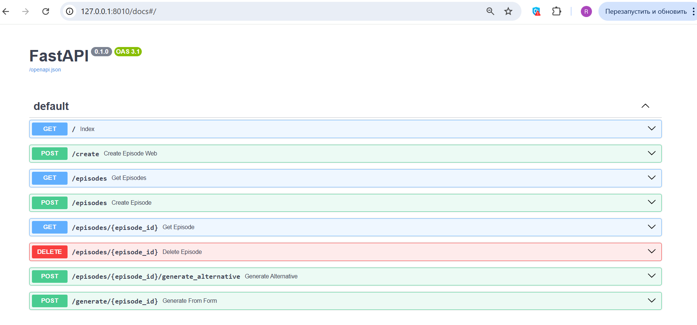
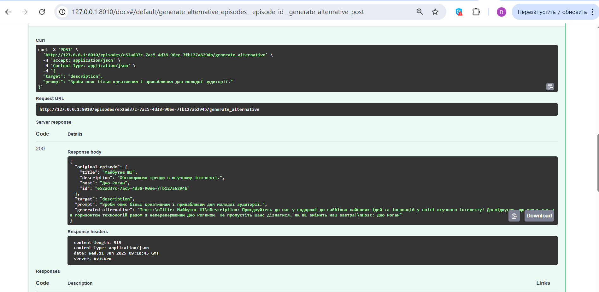

# 🎙️ Facie AI — Podcast Episode Editor with LLM

Facie AI is a FastAPI-based application that allows users to manage podcast episodes and use large language models (LLMs) to generate alternative titles or descriptions.

---

## 📸 Screenshots of REST API in Action

### Swagger UI


### Create Episode via API


### Generate Alternative Description


*(Place your own screenshots in `static/screenshots/`)*
---

## 🛠️ How to Run the App

### 1. Clone the Repository

```bash
git clone https://github.com/yourusername/exercise_Facie_AI.git
cd exercise_Facie_AI
````

### 2. Create `.env` File

```env
# Azure OpenAI
AZURE_OPENAI_KEY=your_azure_key
AZURE_OPENAI_ENDPOINT=https://your-resource-name.openai.azure.com/
AZURE_OPENAI_DEPLOYMENT_ID=your-deployment-id

# Optional: fallback to OpenRouter
USE_OPENROUTER=False
OPENROUTER_API_KEY=your_openrouter_key
OPENROUTER_BASE_URL=https://openrouter.ai/api/v1
OPENROUTER_MODEL=openrouter/your-model-name
```

### 3. Install Dependencies

```bash
pip install -r requirements.txt
```

### 4. Run the App

```bash
uvicorn main:app --reload
```

Visit:

* Web Interface: [http://localhost:8000](http://localhost:8000)
* REST API Docs: [http://localhost:8000/docs](http://localhost:8000/docs)

---

## 📦 API Usage Examples

### ✅ Create a Podcast Episode

**Request:**

```http
POST /episodes
Content-Type: application/json

{
  "title": "The Future of AI",
  "description": "Discussing trends in artificial intelligence.",
  "host": "Joe Rogan"
}
```

**Response:**

```json
{
  "id": "e3b23f89-31d7-4f3d-b199-77e180afe123",
  "title": "The Future of AI",
  "description": "Discussing trends in artificial intelligence.",
  "host": "Joe Rogan"
}
```

---

### 🧠 Generate Alternative Title or Description

**Request:**

```http
POST /episodes/{episode_id}/generate_alternative
Content-Type: application/json

{
  "target": "description",
  "prompt": "Rewrite this for teenagers"
}
```

**Response:**

```json
{
  "original_episode": {
    "id": "e3b23f89-31d7-4f3d-b199-77e180afe123",
    "title": "The Future of AI",
    "description": "Discussing trends in artificial intelligence.",
    "host": "Joe Rogan"
  },
  "target": "description",
  "prompt": "Rewrite this for teenagers",
  "generated_alternative": "Exploring how AI is shaping the world in a fun and relatable way for Gen Z."
}
```

---

### 📋 Get All Episodes

```http
GET /episodes
```

**Response:**

```json
[
  {
    "id": "e3b23f89-31d7-4f3d-b199-77e180afe123",
    "title": "The Future of AI",
    "description": "Discussing trends in artificial intelligence.",
    "host": "Joe Rogan"
  }
]
```

---

### ❌ Delete Episode

```http
DELETE /episodes/{episode_id}
```

**Response:**

```json
{
  "status": "Episode deleted successfully."
}
```

---

## 🗂 Project Structure

```
exercise_Facie_AI/
├── main.py                 # FastAPI app
├── config.py               # .env config
├── schemas.py              # Pydantic models
├── storage.py              # In-memory episode store
├── services/llm_client.py  # LLM integration
├── templates/index.html    # Web UI (Jinja2)
├── static/style.css        # CSS styling
├── static/screenshots/     # Add your API screenshots here
├── requirements.txt        # Dependencies
├── .env                    # API keys
└── README.md               # This file
```

---

## 🧠 Notes

* Web UI available at `/`
* REST API available at `/docs`
* Uses in-memory storage (data resets on restart)
* Choose between Azure OpenAI and OpenRouter in `.env`

---

## 📌 TODO (Future Improvements)

* SQLite-based persistent storage
* Multi-language support
* Auth for episode management
* Multiple LLM output variants

---

## 📜 License

MIT License

---


